  <picture>
    <source media="(prefers-color-scheme: dark)" srcset="./img/header-dark.svg">
    <source media="(prefers-color-scheme: light)" srcset="./img/header-light.svg">
    
  </picture>

 

## Roadmap.sh Projects

Roadmap.sh Projects es una sección dentro de la popular plataforma de código abierto roadmap.sh, la cual es ampliamente reconocida por ofrecer hojas de ruta (roadmaps) visuales y guiadas para el aprendizaje de desarrolladores.

El propósito principal de esta sección es proporcionar ideas y guías de proyectos prácticos para que los desarrolladores puedan aplicar, practicar y reforzar los conocimientos teóricos adquiridos en las hojas de ruta.

[🌐Web Oficial](https://roadmap.sh/) | [📁Soluciones](./roadmap.sh-projects/README.md)

---

## Front-End Mentor

Frontend Mentor es una plataforma de aprendizaje práctico diseñada para ayudar a los desarrolladores web (especialmente de frontend y full-stack) a mejorar sus habilidades construyendo proyectos reales, en lugar de seguir tutoriales paso a paso.

Su principal objetivo es cerrar la brecha entre aprender la teoría de la programación y estar listo para trabajar en un entorno profesional real

[🌐 Web Oficial](https://www.frontendmentor.io/) | [📁 Soluciones](./front-end-mentor/README.md)

---

## Edabit

Edabit es una plataforma de aprendizaje en línea diseñada para ayudar a los desarrolladores a aprender y practicar programación a través de desafíos interactivos y fragmentados (conocidos como "bite-sized challenges").

Su filosofía principal es "aprender programando de manera terca" (learn programming the stubborn way): escribir código, romperlo, arreglarlo y repetir hasta que el cerebro internalice la lógica, en lugar de limitarse a ver tutoriales pasivamente.

[🌐 Web Oficial](https://edabit.com/es) | [📁 Soluciones](./edabit-solutions/README.md)

---